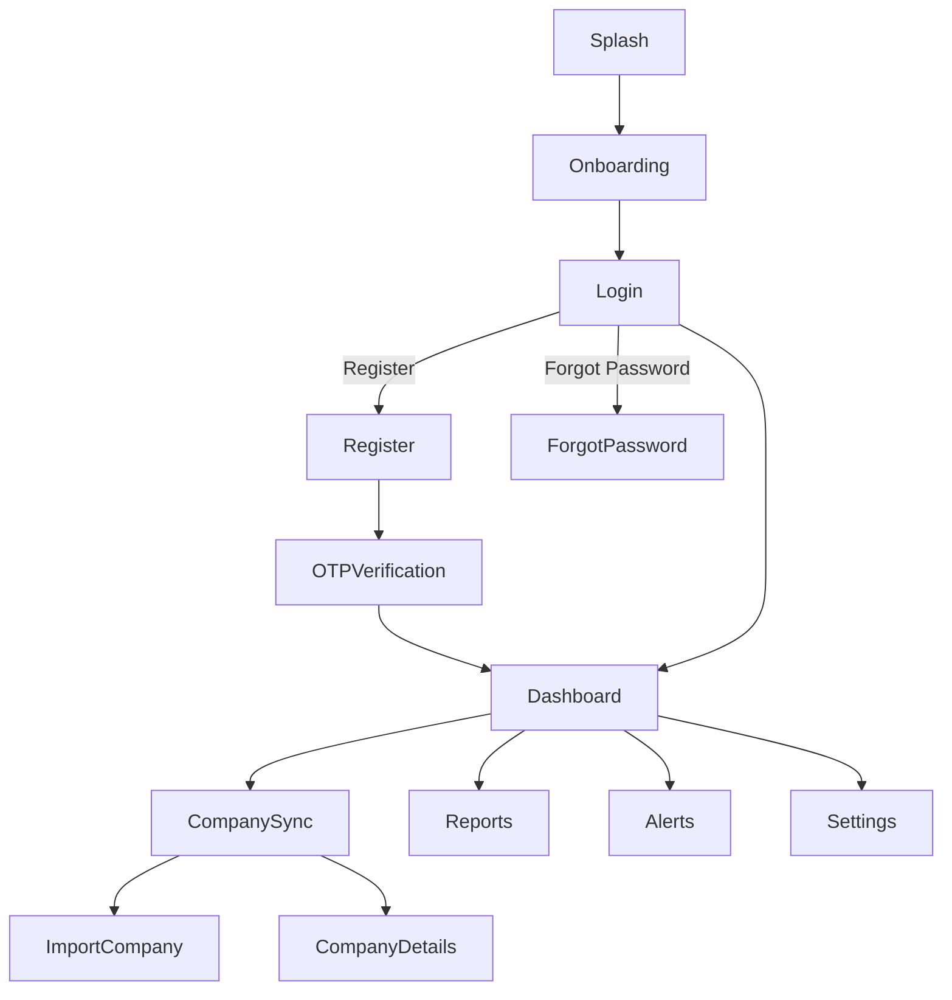

# Mobile Application Requirements & Design Document

## 1. Overview
This document outlines the requirements, design themes, authentication flows, and all essential screens and features for the Talliffy Mobile Application. It serves as a comprehensive guide for designers, developers, and stakeholders.

---

## 2. Target Platforms
- Android (min. Android 8.0)
- iOS (min. iOS 13)
- Responsive for phones and tablets

---

## 3. Design Theme
- **Primary Color:** #000000 (Black)
- **Accent Color:** #2563eb (Blue 600)
- **Success:** #059669 (Emerald 600)
- **Warning:** #f59e42 (Amber 600)
- **Error:** #dc2626 (Rose 600)
- **Background:** #f9fafb (Gray 50)
- **Text:** #ffffff (on dark), #111827 (on light)
- **Font:** Inter, system default sans-serif
- **Button Style:**
  - All buttons: Black background, white text, no border, no color variation on hover/active
  - Rounded corners (8px)
  - Consistent padding (min. 14px vertical, 24px horizontal)
- **Card Style:**
  - White background, subtle shadow, rounded corners
- **Navigation:**
  - Bottom tab bar (for main navigation)
  - Hamburger menu for secondary actions
- **Iconography:**
  - Simple, line icons (Material or Feather)

---

## 4. Authentication Flow
### 4.1. Registration
- User enters mobile number, company code, and email
- Receives OTP via SMS/email
- Enters OTP to verify
- Sets password
- Registration complete

### 4.2. Login
- User enters mobile number/company code and password
- Option to login via OTP
- If OTP selected, receives OTP and verifies
- On success, navigates to dashboard

### 4.3. Forgot Password
- User enters mobile number/company code
- Receives OTP
- Enters OTP and sets new password

### 4.4. Security
- All API calls authenticated with JWT
- Device token for device identification
- Session timeout and re-authentication

---

## 5. Main Screens & Flows

### 5.1. Splash Screen
- App logo, loading animation

### 5.2. Onboarding
- Welcome slides (3-4 screens)
- Brief about features: Sync, Reports, Alerts

### 5.3. Login/Register
- Dual-mode (toggle between Login and Register)
- Fields: Mobile, Company Code, Email, Password, OTP
- Buttons: Login, Register, Send OTP, Resend OTP
- Error and success messages

### 5.4. Dashboard
- Quick action cards (horizontal scroll): Import Company, Sync, Reports, Alerts
- Key metrics: Total Companies, Synced, Pending, Errors
- Live sync health indicator

### 5.5. Company Sync
- List of imported companies
- Search/filter by name, code, status
- Company details modal (on tap)
- Sync button for each company
- Status indicators (Synced, Pending, Error)

### 5.6. Import Company
- Form to add/import new company
- Fields: Name, Code, State, Country, etc.
- Validation and feedback

### 5.7. Reports
- List of available reports
- Filter by date, company, type
- Download/share options

### 5.8. Alerts & Notifications
- List of alerts (sync issues, updates)
- Mark as read, filter by type

### 5.9. Settings
- Profile management
- Change password
- Device management
- App version, support, logout

---

## 6. User Roles & Permissions
- **Admin:** Full access (manage companies, users, settings)
- **User:** Limited to assigned companies and actions

---

## 7. API Integration
- All endpoints must be secured (JWT, device token)
- Endpoints:
  - `/auth/register`
  - `/auth/login`
  - `/auth/verify-otp`
  - `/auth/resend-otp`
  - `/companies`
  - `/companies/:id/sync`
  - `/reports`
  - `/alerts`

---

## 8. Error Handling & Feedback
- All errors must be user-friendly
- Show loading indicators for all async actions
- Success, warning, and error toasts/alerts

---

## 9. Accessibility
- High contrast for text/buttons
- Large tap targets
- Screen reader support

---

## 10. Additional Features (Optional/Future)
- Biometric login (FaceID/TouchID)
- Push notifications
- Offline mode (sync when online)
- Multi-language support

---

## 11. Flow Diagram

---

## 12. Deliverables
- Figma/Sketch design files for all screens
- Style guide (colors, typography, components)
- API documentation
- Test cases for all flows
- Build scripts for Android/iOS

---

## 13. References
- [Material Design Guidelines](https://m3.material.io/)
- [Tailwind CSS Colors](https://tailwindcss.com/docs/customizing-colors)

---

*End of Document*